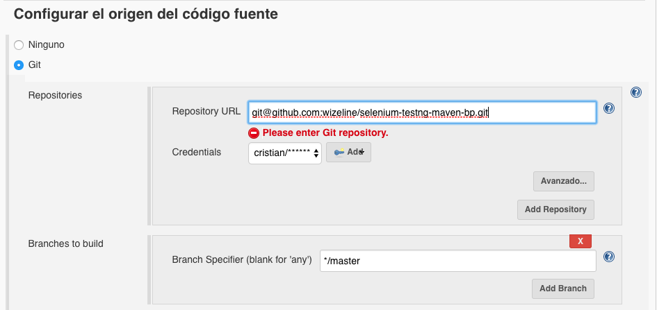
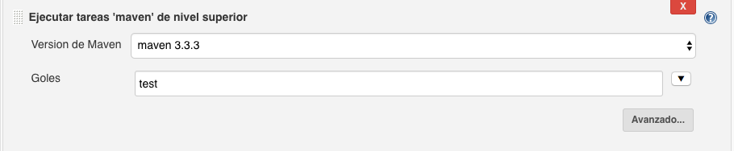

# selenium-testng-maven-bp
Automation Framework bp with SeleniumHQ + TestNG in a maven project.

Resources needed
==========
Recommended install [IntelliJ IDEA](https://www.jetbrains.com/idea/download/)

Install: [JDK](http://www.oracle.com/technetwork/java/javase/downloads/index.html) (version:Latest)

Install: [Maven](https://maven.apache.org/install.html)

Environment 
==========
Clone GitHub repository and install dependencies:

	git clone git@github.com:wizeline/selenium-testng-maven-bp.git

Run the tests locally 
==========
By command line:

	mvn test

Integrate with Jenkins
==========
### Github repo setup
Create a new Jenkins Job and add the Github Repo.
Make sure git credentials are provided:

    git@github.com:wizeline/selenium-testng-maven-bp.git

### Execute Maven: 

### Reporters configuration:  
Two extra plugins could be used and need to be installed by a jenkins admin:  
__HTML Publisher__  
__JUnit Realtime Test Reporter__   

